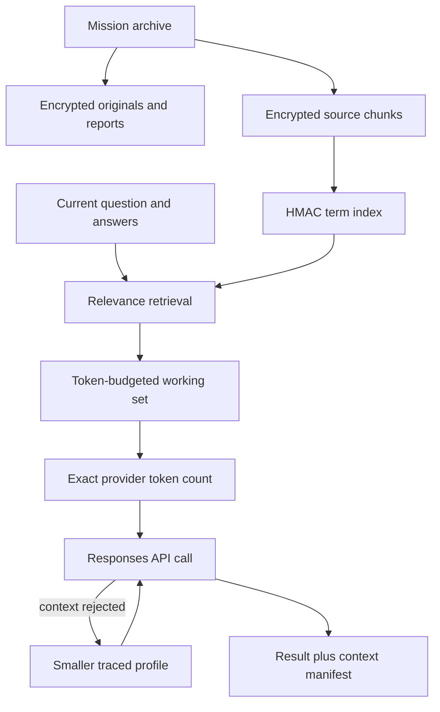

# SRIS · Scalable Mission Context Archive v1

## Problem corrected

A Mission may accumulate far more information than any model can accept in one
request. The previous interactive path serialized the complete canonical
document and deterministic report, added large extracted attachment text and,
for PDFs or images, could also transmit the complete binary files. Mission
growth was therefore incorrectly coupled to a provider context window.

The archive and the model call are now separate systems:

- the Mission preserves the complete canonical document, every governed turn
  and every original attachment;
- text-bearing sources are indexed as encrypted overlapping chunks at ingest;
- every deterministic/AI report and governed external-research dossier is
  indexed after it is preserved, so older turns remain selectively retrievable;
- each turn retrieves a bounded working set using the current question,
  answers, central question and current-turn attachment priority;
- the provider receives only that working set and a `context_manifest`;
- a provider context-size rejection triggers a smaller traced profile and a
  new attempt, never blind deletion or silent provider truncation.

## Non-negotiable invariants

1. **Archive preservation is independent of context size.** There is no
   application-level aggregate attachment cap per Mission and no 1,000-record
   or 3,000-relation ceiling in the canonical contract. Preserved reports and
   external research use the same retrieval plane as attachments.
2. **The original source is authoritative.** Attachments remain encrypted and
   content-addressed by SHA-256. Retrieval chunks are derived working copies.
3. **No silent omission.** Every successful interactive result records archive
   totals, selected canonical IDs, selected attachment IDs, selected chunk
   count, context profile and retry count.
4. **No blind truncation.** Responses requests explicitly use
   `truncation="disabled"`. The SRIS selects context itself so that relevance
   and provenance remain auditable.
5. **No epistemic promotion.** Retrieved user documents remain `in_review`.
   Selection does not turn a document, excerpt or model statement into fact.
6. **No clear-text search index.** Chunk text is encrypted with AES-GCM. Search
   terms are organization-keyed HMAC fingerprints; the database index does not
   expose the source vocabulary.

## Processing path

## Context profiles

The request builder prepares ordered profiles: `standard`, `compact`,
`minimal` and `emergency`. It chooses the richest profile that fits the
organization's governed input-token budget. Smaller fitting profiles are kept
as automatic fallbacks for a provider-declared context-size rejection.

Each profile independently bounds:

- canonical records and relations;
- archive chunks and excerpt length;
- dialogue turns and proposal reviews;
- direct visual/file inputs.

The complete archive is never copied into these profiles.

## Scale and physical capacity

"No Mission-level context limit" does not mean infinite hardware. Each single
upload retains a 20 MB safety limit, Office archives retain decompression-bomb
protections, the database/object-storage tier still has finite purchased
capacity and the AI provider still has a finite context window per request.
Those are physical and security constraints. They no longer cause the SRIS to
reject a Mission merely because its accumulated archive is larger than one
model call.

Text sources and preserved intelligence reports are indexed automatically.
This includes external-research dossiers and their traceable source metadata.
Image-only or scanned sources that do
not yield local text remain preserved and are eligible for direct visual/file
reading when explicitly relevant and when the working-set budget permits it.
The manifest exposes how many sources were prioritized and which were actually
included; remaining sources stay available for later targeted turns or a
dedicated extraction process.

## Database migration

Alembic revision `20260815_0010` adds:

- `mi_archive_chunks` — encrypted chunk text, generic source identity, source
  position and integrity hash;
- `mi_archive_chunk_terms` — indexed organization-keyed term fingerprints.

New attachment sources are indexed in the upload transaction and every new
intelligence run is indexed after its authoritative report is stored. Existing
encrypted attachments and legacy intelligence runs are backfilled lazily in
bounded batches, prioritizing current attachments and recent reports.

## Verification contract

Automated coverage includes:

- a canonical Mission with 2,500 records and 3,500 relations;
- a simulated archive of 10,000 attachments and 120,000 chunks;
- selection of the relevant late record under a 60,000-token governance
  budget;
- encrypted original, encrypted chunk and non-clear-text term index checks;
- later retrieval of a preserved external-research dossier;
- automatic retry after a provider `context_length_exceeded` error;
- persistence and recovery of the context manifest in dialogue history;
- fresh migration, downgrade to revision `0009` and re-upgrade to `0010`.
