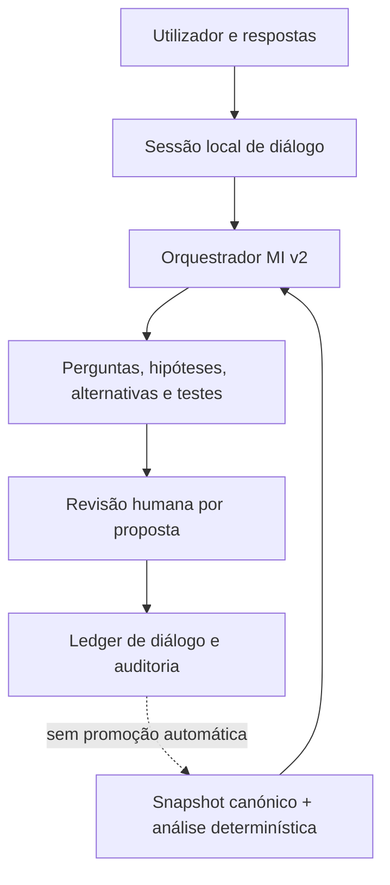

# SRIS — Mission Intelligence interativa v2

Estado: implementada no repositório; implantação e smoke test real ao fornecedor
pendentes

Versão da aplicação: `1.6.0`

Versão do contrato: `2.0`

Versão do prompt: `sris-mi-interactive-2.0`

Migração: `20260812_0007`

## 1. Resultado

A Mission Intelligence v2 transforma a antiga análise assistiva, orientada a um
relatório único, num diálogo institucional persistente. Em cada turno, o motor
pode:

- responder diretamente a uma pergunta sobre a missão;
- revelar o bloqueio, a tensão e o ponto cego mais materiais;
- formular perguntas de elevado valor de informação;
- propor hipóteses e contra-hipóteses testáveis;
- criar alternativas genuinamente diferentes das existentes;
- explicitar critérios e regras de decisão;
- desenhar experiências com baseline, comparador, medidas, regras e condições
  de paragem;
- desafiar uma formulação ou opção existente;
- converter a análise em próximas ações com dependências e efeito decisório.

O motor acrescenta possibilidades de investigação e decisão. Não acrescenta
factos, não escolhe uma alternativa e não altera silenciosamente a missão.

## 2. Arquitetura

O snapshot completo e o relatório determinístico acompanham cada pedido. O
estado conversacional é reconstruído a partir da base de dados do SRIS; não se
depende de retenção do fornecedor. Todos os pedidos usam `store=false`.

Esta opção segue o padrão de execução da Responses API, mas mantém o estado sob
controlo institucional. A documentação oficial distingue estado gerido pelo
cliente e estado persistido pelo fornecedor: [conversation
state](https://developers.openai.com/api/docs/guides/conversation-state).

## 3. Intenções suportadas

| Intenção | Pergunta operacional |
|---|---|
| `diagnose` | O que está realmente a bloquear a qualidade da missão? |
| `answer` | Como muda a leitura com esta resposta do utilizador? |
| `challenge` | Que pressuposto, alternativa ou raciocínio deve ser contestado? |
| `explore_alternatives` | Que opções diferentes e reversíveis ainda não foram consideradas? |
| `design_experiment` | Qual é a forma mais curta de reduzir a incerteza material? |
| `compare_options` | Com que critérios, limiares e trade-offs se devem comparar opções? |
| `synthesize` | Qual é o próximo movimento defensável neste estado da missão? |

A interface expõe os cinco modos de trabalho mais frequentes e mantém as outras
intenções no contrato API para fluxos posteriores.

## 4. Contrato epistemológico

| Objeto gerado | Estado obrigatório | Efeito canónico |
|---|---|---|
| Hipótese | `hypothesis_for_testing` | Nenhum |
| Alternativa | `alternative_proposal` | Nenhum |
| Critério | `criterion_proposal` | Nenhum |
| Experiência | `experiment_proposal` | Nenhum |
| Pergunta, desafio ou ação | Provisório e ancorado em IDs | Nenhum |
| Revisão humana | `accepted_as_draft`, `rejected` ou `deferred` | Nenhum |

Cada leitura e proposta inclui `based_on_ids`. O backend rejeita IDs que não
existam no snapshot e rejeita experiências que apontem para hipóteses
desconhecidas. IDs gerados têm de ser únicos dentro do turno.

O Structured Output garante a forma do resultado; não garante, por si só, a
correção substantiva. Por isso, o SRIS acrescenta validação de referências,
limiares mínimos de profundidade, revisão humana e avaliações de domínio. Ver
[Structured Outputs](https://developers.openai.com/api/docs/guides/structured-outputs).

## 5. Gate de qualidade

Uma saída estruturalmente válida pode continuar a ser demasiado passiva. A v2
rejeita respostas abaixo destes mínimos:

| Intenção | Mínimos específicos |
|---|---|
| `diagnose` | 3 perguntas, 2 hipóteses distintas, 1 alternativa, 3 critérios, 1 experiência, 1 desafio e 2 ações |
| `answer` | 1 ação |
| `challenge` | 2 desafios e 1 hipótese |
| `explore_alternatives` | 2 alternativas e 3 critérios |
| `design_experiment` | 1 experiência e 2 critérios |
| `compare_options` | 3 critérios |
| `synthesize` | 1 ação |

Em diagnóstico, uma das duas hipóteses deve funcionar como explicação
alternativa ou contra-hipótese. A novidade da hipótese e a diferença de cada
alternativa não podem ser descrições vazias ou meramente nominais.

O caso de avaliação `MI-EVAL-M001-001` fixa ainda critérios de domínio para a
missão florestal de cinco hectares: linha de base, comparador, autorização,
combustível e reversibilidade têm de entrar no raciocínio sem transformar a
presença pontual de água, a eficácia de uma intervenção ou a autorização em
factos demonstrados. A abordagem segue avaliação orientada a critérios e casos
de fronteira, como recomendado em [evaluation best
practices](https://developers.openai.com/api/docs/guides/evaluation-best-practices).

## 6. Persistência e auditabilidade

A migração acrescenta:

- `mi_dialogue_sessions`: objetivo, missão, snapshot e estado da conversa;
- `mi_dialogue_turns`: sequência, intenção, mensagem, respostas e ligação à
  execução existente;
- `mi_proposal_reviews`: disposição humana granular de cada proposta.

Cada turno continua a criar um `mi_intelligence_runs` e a ligar-se ao mesmo
ledger `mi_ai_usage_events`. Ficam preservados snapshot hash, versão do motor,
modelo, prompt, response ID, tokens, custo, pesquisas web e utilizador.

Se o snapshot canónico mudar, a sessão anterior não aceita um novo turno. O
cliente recebe `mission_snapshot_changed` e tem de iniciar uma sessão sobre a
nova revisão. Esta regra impede que a conversa misture silenciosamente versões
distintas da missão.

## 7. Contexto e custo

Controlos aplicados a cada turno:

- máximo de quatro turnos recentes candidatos a contexto;
- máximo de `13 000` bytes UTF-8 de histórico compacto;
- máximo de `4 000` bytes UTF-8 de revisões humanas;
- preservação prioritária do turno mais recente;
- máximo padrão de `6 000` tokens de saída, com ou sem pesquisa;
- reserva conservadora antes de qualquer chamada e contagem exata quando o
  endpoint do fornecedor está disponível;
- teto mensal, teto por pedido, orçamento e concorrência por organização;
- pesquisa web apenas quando o utilizador a pede e o segundo gate está ativo.

A investigação contextual usa pesquisa web obrigatória, valida que as fontes
do dossier foram efetivamente recuperadas e mantém `research_status=in_review`.
O loop de uso de ferramentas e validação de resultados segue o padrão descrito
em [function calling](https://developers.openai.com/api/docs/guides/function-calling).

## 8. API

| Método | Endpoint | Finalidade |
|---|---|---|
| `POST` | `/api/organizations/{org}/mission-intelligence/demo/{mission}/interact` | Executar um turno ou continuar uma sessão |
| `GET` | `/api/organizations/{org}/mission-intelligence/dialogues` | Listar sessões, opcionalmente por missão |
| `GET` | `/api/organizations/{org}/mission-intelligence/dialogues/{session}` | Reconstruir turnos, propostas, custos e revisões |
| `PUT` | `/api/organizations/{org}/mission-intelligence/dialogues/{session}/turns/{turn}/proposals/{proposal}/review` | Aceitar como rascunho, rejeitar ou adiar uma proposta |

O endpoint público continua exclusivamente determinístico. A IA exige sessão,
papel autorizado, organização piloto, política ativa e saldo disponível.

## 9. Interface

O estúdio Mission Intelligence aparece antes do antigo modo de auditoria
narrativa. Inclui:

- seletor de intenção;
- compositor de perguntas e respostas;
- pesquisa contextual opcional;
- perguntas respondíveis no próprio turno;
- cartões distintos para hipóteses, alternativas, critérios e experiências;
- desafio crítico, ações e próximo movimento;
- decisão humana individual por proposta;
- custo, proveniência e fronteira canónica visíveis;
- recuperação da sessão ativa no mesmo navegador e reconstrução a partir do
  servidor.

O relatório assistivo v1 permanece disponível como modo de auditoria e para
compatibilidade. Já não é apresentado como a capacidade principal.

## 10. Implantação controlada

1. Implantar com `SRIS_AI_ENABLED=false` e
   `SRIS_CONTEXT_RESEARCH_ENABLED=false`.
2. Executar `alembic upgrade head` e confirmar a revisão `20260812_0007`.
3. Confirmar `/health` e `/api/mission-intelligence/status`.
4. Manter `max_concurrent_requests=1`,
   `per_request_input_token_limit>=60000` e
   `per_request_output_token_limit>=6000` no primeiro piloto.
5. Ativar apenas a organização piloto e executar um único diagnóstico de
   M-001 sem pesquisa.
6. Confirmar as sete famílias mínimas do diagnóstico, IDs canónicos, custo e
   `canonical_mutation=none`.
7. Rever uma alternativa como `accepted_as_draft` e confirmar que a missão
   canónica não mudou.
8. Responder a uma pergunta no segundo turno e confirmar que o histórico foi
   considerado.
9. Desativar a política e rever o ledger antes de abrir novo consumo.
10. Só depois, testar pesquisa contextual em staging.

## 11. Limites deliberados desta versão

- Não foi efetuada uma chamada paga ao fornecedor durante a implementação.
- PDFs, apresentações e vídeo do Sanctuary informaram o caso de domínio, mas
  ainda não existe ingestão canónica direta desses ficheiros para o diálogo.
- O corpus completo não dispõe ainda de ferramentas de recuperação seletiva;
  esta versão envia o snapshot governado completo. Ferramentas locais de
  leitura tornam-se necessárias quando as missões excederem este envelope.
- `accepted_as_draft` é um estado de revisão, não um endpoint de promoção para
  a missão canónica.
- O motor não executa ações externas, não solicita autorizações e não comunica
  com entidades em nome do utilizador.
- A qualidade científica e territorial continua dependente de observação,
  competência técnica, fontes e validação humana fora do modelo.

## 12. Verificação local

Checkpoint de 12 de agosto de 2026:

- 46 testes de Mission Intelligence aprovados;
- 81 testes aprovados e 35 especificações legadas ignoradas na suíte completa;
- migração validada em subida, descida para `20260810_0006` e nova subida;
- JavaScript validado sintaticamente e HTML analisado com 74 IDs únicos;
- wheel `sris_enterprise-1.6.0-py3-none-any.whl` construída com sucesso;
- avaliação de domínio versionada em
  [`MI-EVAL-M001-001`](../backend/tests/fixtures/mission_intelligence_m001_eval.json).
